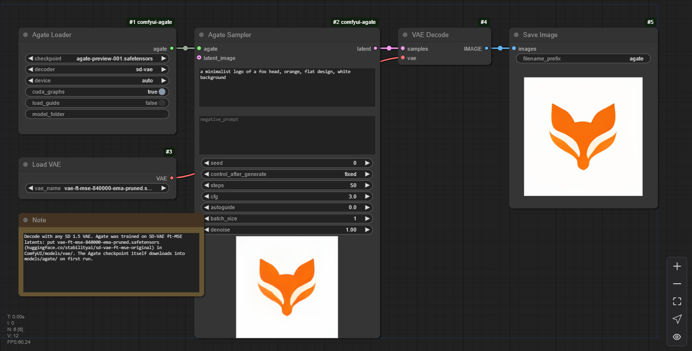
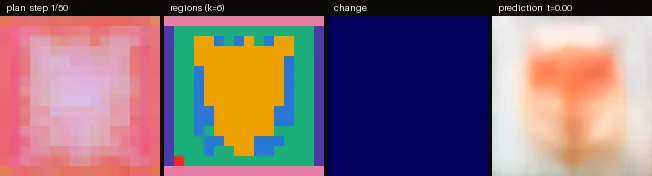
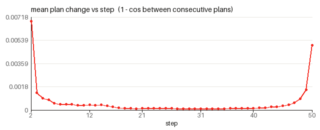

# Agate for ComfyUI

ComfyUI nodes for **[Agate](https://huggingface.co/Logolabs/agate-preview-001)**, the 260M-parameter
text-to-image model from [LogoLabs](https://logolabs.org). Agate was trained from scratch in 145 GPU-hours and
scores 0.550 on GenEval with the official scorer. It renders a 256 × 256 image in under two seconds on a
consumer GPU, and it samples in the SD 1.x latent space, so it plugs into ComfyUI's own VAE, preview,
upscale and img2img nodes.

<p align="center"></p>
<p align="center"><sub><i>"a minimalist logo of a fox head, orange, flat design, white background"</i>, seed 0, 50 steps, cfg 3</sub></p>

<p align="center"></p>

Try it in the browser first, without installing anything:
[Agate WebGPU demo](https://huggingface.co/spaces/Logolabs/agate-webgpu).

## Install

**ComfyUI Manager:** *Manager → Install via Git URL* → `https://github.com/logolabs/agate-comfyui`, then restart ComfyUI.

**By hand:**

```bash
cd ComfyUI/custom_nodes
git clone https://github.com/logolabs/agate-comfyui
pip install -r agate-comfyui/requirements.txt     # with ComfyUI's Python; portable build:
                                                  # ..\python_embeded\python.exe -m pip install -r agate-comfyui\requirements.txt
```

Restart ComfyUI. The nodes appear under **LogoLabs → Agate**. Drag one of the
[example workflows](#example-workflows) onto the canvas.

Requirements: ComfyUI's own PyTorch (CUDA, CPU or other devices), plus `diffusers>=0.30` and
`transformers>=4.48` (ModernBERT, which the Ettin text encoder uses; older ComfyUI installs ship an older
transformers). Nothing in `requirements.txt` pins or replaces torch.

### Model files

| File | Where | |
|---|---|---|
| `agate-preview-001.safetensors` (522 MB) | `ComfyUI/models/agate/` | Generator + text encoder, tokenizer and config in one file. **Downloaded automatically** on first use from [`Logolabs/agate-preview-001`](https://huggingface.co/Logolabs/agate-preview-001/tree/main/comfyui) |
| `agate-guide-27600.safetensors` (522 MB) | `ComfyUI/models/agate/` | Only for `autoguide` > 0. Downloaded automatically the first time you use it |
| `vae-ft-mse-840000-ema-pruned.safetensors` (335 MB) | `ComfyUI/models/vae/` | The SD 1.5 VAE, for the stock **VAE Decode** after **Agate Sampler**. Get it from [stabilityai/sd-vae-ft-mse-original](https://huggingface.co/stabilityai/sd-vae-ft-mse-original/blob/main/vae-ft-mse-840000-ema-pruned.safetensors); most SD 1.5 setups already have it |

To install offline, download the two files from the
[`comfyui/` folder of the model repo](https://huggingface.co/Logolabs/agate-preview-001/tree/main/comfyui) and put
them in `ComfyUI/models/agate/` (an `agate:` entry in `extra_model_paths.yaml` works too). The model is
public; no Hugging Face login is needed. **Agate Generate** also fetches its own decoder the first time
(the diffusers copies of `stabilityai/sd-vae-ft-mse` or `madebyollin/taesd`, into the Hugging Face cache).

## Example workflows

In [`example_workflows/`](example_workflows) (ComfyUI Manager and the Comfy Registry show these as templates):

| Workflow | Graph |
|---|---|
| [`agate_txt2img.json`](example_workflows/agate_txt2img.json) | Agate Loader → **Agate Sampler** → VAE Decode (SD 1.5 VAE) → Save Image |
| [`agate_generate.json`](example_workflows/agate_generate.json) | Agate Loader → **Agate Generate** → Save Image. No VAE file needed |
| [`agate_upscale_4x.json`](example_workflows/agate_upscale_4x.json) | txt2img → Upscale Image By (lanczos, 4×) → Save Image, for 1024 × 1024 output |
| [`agate_plan_viewer.json`](example_workflows/agate_plan_viewer.json) | Agate Loader → **Agate Plan Viewer** → Save Image (final image), Preview Image (per-step panels), Save Animated WEBP (panels at 12 fps), Preview Image (change curve). See [See the plan](#see-the-plan) |

## Nodes

### Agate Loader → `AGATE_MODEL`

| Input | Default | |
|---|---|---|
| `checkpoint` | `agate-preview-001.safetensors` | Single-file checkpoints in `models/agate/`. The official one is downloaded if it is missing |
| `decoder` | `sd-vae` | Only used by **Agate Generate**: `sd-vae` (SD-VAE ft-MSE, best quality) or `taesd` (tiny decoder: faster and lighter, a little softer) |
| `device` | `auto` | `auto` uses ComfyUI's device; or force `cuda` / `cpu` |
| `cuda_graphs` | on | Records each denoising step as a CUDA graph and replays it. Agate is small enough that kernel launches, not arithmetic, dominate an eager step. Ignored off CUDA |
| `load_guide` | off | Preloads the guide model that `autoguide` uses. Otherwise it loads the first time a sampler asks for it |
| `model_folder` (optional) | empty | Advanced: load a release-layout folder (`config.json`, `generator.safetensors`, `text_encoder/`) or a Hugging Face repo id instead of the checkpoint |

### Agate Sampler → `LATENT`

| Input | Default | |
|---|---|---|
| `agate` | | From Agate Loader |
| `prompt` | | English prompt; up to 512 tokens are read |
| `negative_prompt` | empty | The unconditional side of classifier-free guidance. Agate was trained with the empty prompt there, so leave it empty unless you want to push away from something |
| `seed` | 0 | With the usual control_after_generate (fixed / increment / randomize) |
| `steps` | 50 | Euler steps over the flow path (over the remaining part of it for img2img) |
| `cfg` | 3.0 | Classifier-free guidance scale |
| `autoguide` | 0.0 | 0–3. Also steers away from Agate's own early (step 27,600) checkpoint, which sharpens faces and fine detail. Try 1.0 with cfg 4. Costs about 50% more time |
| `batch_size` | 1 | Images per run from one seed. Ignored when `latent_image` is connected |
| `denoise` | 1.0 | With `latent_image`: how much to change it. 1.0 ignores its content (plain txt2img), 0.0 returns it unchanged |
| `latent_image` (optional) | | An SD 1.x LATENT to start from: VAE Encode of an image, or an earlier Agate Sampler |

The output is a standard SD 1.x LATENT (unscaled VAE latents, 4 × 32 × 32 for 256 px, the same
convention as VAE Encode / VAE Decode). Decode it with **VAE Decode** and an SD 1.5 VAE, save it, or feed
it into anything that takes SD 1.x latents. The node shows ComfyUI's live preview while it samples
(latent2rgb or TAESD, whichever `--preview-method` selects), and Cancel stops it at the next step.

**img2img.** Agate is a rectified flow from noise at t = 0 to the image at t = 1, x_t = (1 − t)·noise + t·x.
With a `latent_image` and `denoise` = d, the sampler noises the latent to t = 1 − d and runs `steps` Euler
steps from there. Load Image → VAE Encode → Agate Sampler with denoise below 1 re-renders an image (at
0.6 the layout and colours survive, and the prompt changes details); an Agate latent fed back in at a
low denoise gives variations. Agate was trained at 256 px only: other
latent sizes run (sides divisible by 32 px) but are out of distribution.

### Agate Generate → `IMAGE`

The all-in-one node: the same inputs as Agate Sampler without the img2img ones, decoded with the loader's
`decoder` into a standard image batch (B × 256 × 256 × 3, floats in 0–1). Use it when you do not have
an SD 1.5 VAE file. Its images match Sampler → VAE Decode to within 5/255 per pixel (mean 0.2/255), the
difference between the diffusers and ComfyUI VAE implementations.

## See the plan

Agate does not paint pixels straight from the prompt. Its **thinker** first writes a *plan*: a
640-channel map on a 16 × 16 grid (one cell per 16 × 16 pixels) that says what goes where. The
**renderer** then paints the image from that plan alone. **Agate Plan Viewer** samples one image and
records the plan at every denoising step, so you can watch the layout being decided.

<p align="center"></p>
<p align="center"><sub><i>"a dog sitting to the left of a cat"</i>, seed 0, 50 steps: plan · regions · change · prediction</sub></p>
<p align="center"></p>
<p align="center"><sub><i>"a minimalist logo of a fox head, orange, flat design, white background"</i>, seed 0, 50 steps</sub></p>

Inputs are the Sampler's (one image; `autoguide` is not available here) plus `regions` (k, default 6) and
`frame_size` (default 256 px). All outputs except `latent` are ComfyUI IMAGE batches with one frame per step:

| Output | What it shows |
|---|---|
| `image` | The final image, decoded like Agate Generate. It is the same image Agate Sampler gives for the same seed: recording the plan does not change sampling (tested bit for bit, with and without CUDA graphs) |
| `plan_frames` | The plan as colours: its 640 channels projected to RGB with PCA, fitted once over all steps, so a colour means the same thing at every step |
| `region_frames` | The plan split into `regions` parts: one k-means over the (per-step centred, normalised) plan cells of all steps, so a region keeps its colour over time |
| `prediction_frames` | What the model expects the final image to be at that step: x̂₁ = z + (1 − t)·v, decoded with TAESD |
| `change_frames` | How much each cell of the plan changed since the previous step (1 − cosine similarity; dark blue = unchanged, red = most) |
| `panel` | The four side by side with a step label. Feed it to *Save Animated WEBP* or VideoHelperSuite's *Video Combine* |
| `change_curve` | One image: the mean plan change per step |
| `latent` | The final SD 1.x LATENT, as Agate Sampler outputs it |

What it shows: the plan is decided in the **first few steps**. In the dog-and-cat example the two animals are separate regions by step 6 of 50,
long before the
predicted image is sharp, and the plan then stays **almost frozen** through the middle of the trajectory
while the renderer adds detail. The change curve drops by an order of magnitude after the first steps and
only rises again in the last few steps, where the plan is refined at the edges.

<p align="center"></p>

The viewer runs at about the speed of a normal sample: 6.8 s per queued prompt for 50 steps on the RTX 4060,
most of it ComfyUI encoding the 50 preview PNGs and the animated WEBP (the first run of a session is slower,
as for the other nodes). The analysis runs on the GPU and needs no extra packages.

## Tips

- **256 px is native.** For bigger images, upscale the output: *Upscale Image By* (as in
  `agate_upscale_4x.json`), or *Load Upscale Model* + *Upscale Image (using Model)* with a 4× ESRGAN-type
  model for sharper 1024 × 1024. Logos also trace cleanly to SVG with
  [Inkvec](https://github.com/logolabs/inkvec-comfyui).
- **Defaults: 50 steps, cfg 3.** 30 steps is a good draft setting: on a four-prompt check it kept the
  composition of the 50-step image (mean pixel difference 2–10/255) at 60% of the time. At 15–20 steps
  images are still clean, but the composition can drift from the 50-step one.
- **Faces and fine detail:** `autoguide` 1.0 with `cfg` 4.
- **What Agate is bad at:** exact text, counting above three, negation ("a bowl with no fruit" comes back
  full of fruit), and anything above 256 px. It is a research preview and not yet converged. The
  [model card](https://huggingface.co/Logolabs/agate-preview-001) has the full evaluation.

## Memory and speed

Agate registers its weights with ComfyUI's model manager like any built-in model: it is loaded to the GPU
when a sampler runs, stays there between runs, and is moved back to system RAM when another model needs
the VRAM (or when you press *Unload Models*). In bf16 the generator and text encoder take 494 MB of VRAM,
the guide model another 494 MB, and the SD 1.5 VAE 160 MB. Agate always loads whole (also under
`--lowvram`, where it was tested); `--cpu` or `device = cpu` runs it in fp32 on the CPU.

Measured in ComfyUI on an RTX 4060 (8 GB) with TAESD live previews on, CUDA graphs on, wall time per
queued prompt including the PNG save:

| | Time |
|---|---|
| txt2img, 50 steps (Sampler → VAE Decode → Save) | 1.7 s |
| txt2img, 30 steps | 1.05 s |
| Agate Generate, 50 steps | 1.7 s |
| Batch of 4, 50 steps | 4.6 s |
| `autoguide` 1.0 (cfg 4), 50 steps | 2.5 s |
| 4× upscale workflow | 1.75 s |
| After *Unload Models* (weights come back from RAM, CUDA graph re-recorded) | 3.8 s |
| First run after starting ComfyUI | 26–28 s: weights load, cuDNN picks its kernels, the CUDA graph is recorded |
| CPU (`device = cpu`) | about 2–2.7 s per step |

The slow first run happens once per session, and again briefly for each new batch size or prompt-length
bucket (64 / 128 / 256 / 512 tokens), because each input shape gets its own CUDA graph (a new batch size
took 20 s the first time). If you change `batch_size` a lot, turn `cuda_graphs` off: every step then pays
the kernel-launch overhead, but no shape is ever slow.

Note: on CUDA, loading Agate sets `torch.backends.cudnn.benchmark = True` and disables PyTorch's cuDNN
attention backend (`enable_cudnn_sdp(False)`) for the ComfyUI process, because those are the kernels Agate
was trained with. Other models keep working, but they then run with those settings too.

## How it works

The pack vendors Agate's MIT-licensed inference code (`agate_comfy/agate/`, from the
`agate-preview-001` release). The generator is a 191M thinker-steered convolutional flow model, the
text encoder is a fine-tuned Ettin-68M (ModernBERT), and the image comes from the SD-VAE decoder.
`agate_comfy/runtime.py` is the ComfyUI side: the release sampler generalised to start part-way along the
flow path, ModelPatcher-managed weights, previews. `agate_comfy/checkpoint.py` builds the single-file
checkpoints from the release folder (`python -m agate_comfy.checkpoint <release dir> <out dir>`): bf16
weights with the config and tokenizer in the safetensors metadata.

**Parity.** On CUDA the single-file checkpoint reproduces the release pipeline bit for bit (maximum pixel
difference 0, checked at 50 steps on two prompts and with autoguide at batch 2): the release already runs
in bf16 there. On the CPU the release uses the fp32 originals, and the bf16-rounded weights give a mean
difference of 0.24/255 per pixel (a few pixels up to 73/255 at 50 steps). Load the release folder with
`model_folder` if you need the exact fp32 CPU result.

## Tests

```bash
AGATE_CKPT=/path/to/agate-preview-001.safetensors AGATE_SOURCE=/path/to/agate-preview-001 python -m pytest -q tests
```

Runs the nodes end to end with `comfy.*` stubbed: LATENT format and scale, Sampler vs Generate, img2img at
denoise 1 (identical to txt2img) and below, progress and preview callbacks, determinism, batching,
unload/reload, the single file against the release pipeline, and the Plan Viewer (output shapes, same image as the Sampler with and without CUDA graphs, stable k-means). Without `AGATE_CKPT` the checkpoint is
downloaded. `tests/workflows_api/` holds the example workflows in API format for posting to a running
ComfyUI's `/prompt`. Set `AGATE_EXAMPLE=docs/example.png` to re-render the example image.

## License

MIT; see [LICENSE](LICENSE). The Agate weights are MIT-licensed as well; see the
[model card](https://huggingface.co/Logolabs/agate-preview-001). More at [logolabs.org](https://logolabs.org).

## Acknowledgement

We acknowledge EuroHPC JU for awarding the project ID EHPC-AIF-2026PG01-907 access to resources on
Arrhenius GPU at NAISS, Sweden.
